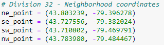

# route_optimization

## Overview of Analysis
The objective of the code is to create a Python program that generates an interactive map displaying a route connecting selected neighborhoods in Toronto, Ontario, Canada.. The program also includes randomly generated points within each neighborhood and can provide valuable insights to several situations.

## Results

These coordinates create the bounderies for the a region in Toronto, Ontario, Canada. This neighbourhood is known as North York and is patroled by Division 32 of the Toronto Police.

As seen in the map, five points of interest are chosen at random and a route is generated to connect all the points together.

## Summary
Throughout this project, I have learned how to create a Python program that helps optimize routes. By generating an interactive map, I have incorporated randomly generated points within each neighborhood to simulate potential crime locations.

In the future, there are several potential improvements that could be made to enhance this program. For instance, one could explore incorporating additional data sources, such as historical delivery data or demographic information, to gain further insights into delivery patterns. Additionally, implementing more advanced algorithms for route optimization, such as the Traveling Salesman Problem, could help officers find the most efficient routes.

Furthermore, adding interactive features to the map, such as allowing users to filter cusine ordered by type or time, would enhance the user experience and provide more flexibility in analyzing the data. Additionally, integrating machine learning techniques could enable the program to make predictions or identify patterns in ordering strategies.

Overall, this project has provided me with a foundation in Python programming and demonstrated the potential for technology to many organizations. With further improvements and exploration of advanced techniques, this program has the potential to become an even more powerful tool for optimizing and predicting routes.
